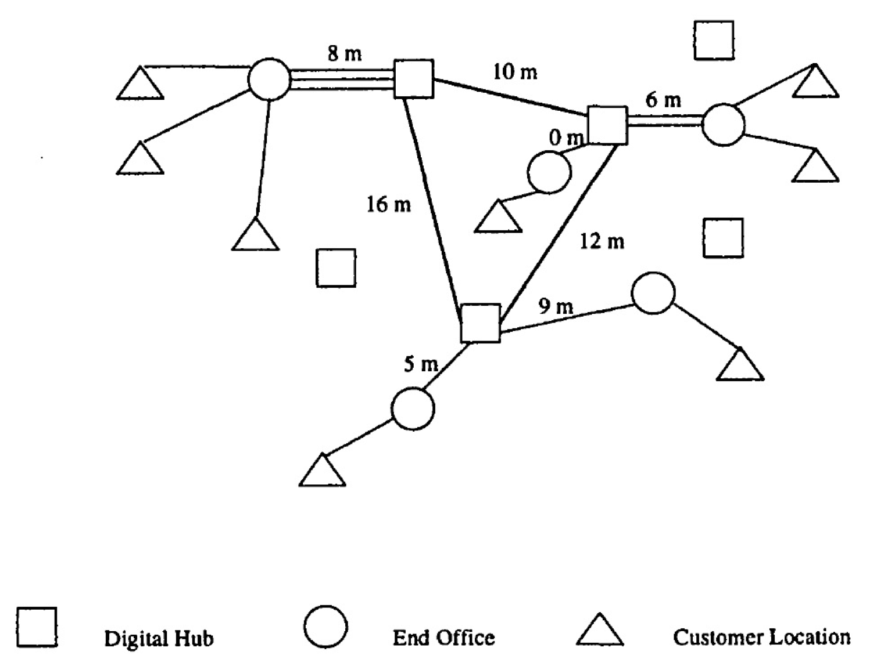

# Telecom-network-optimization
Algorithms to optimize the total cost of links in a telecommunication network under some constraints.

An example of a network.

Constraints :

- Select a set of at least three digital hubs. Connect them together to form a single ring.
- Connect end offices to digital hubs. Each end office must be connected to one of the slected digital hubs. Each hub can be connected to a limited number of end offices.
- Connect customers to end offices. A large enough proportion of the customers must be connected. Each end office can be connected to a limited number of customers.

The connections and selected hubs have attributed cost. The goal is to minimize that cost.
